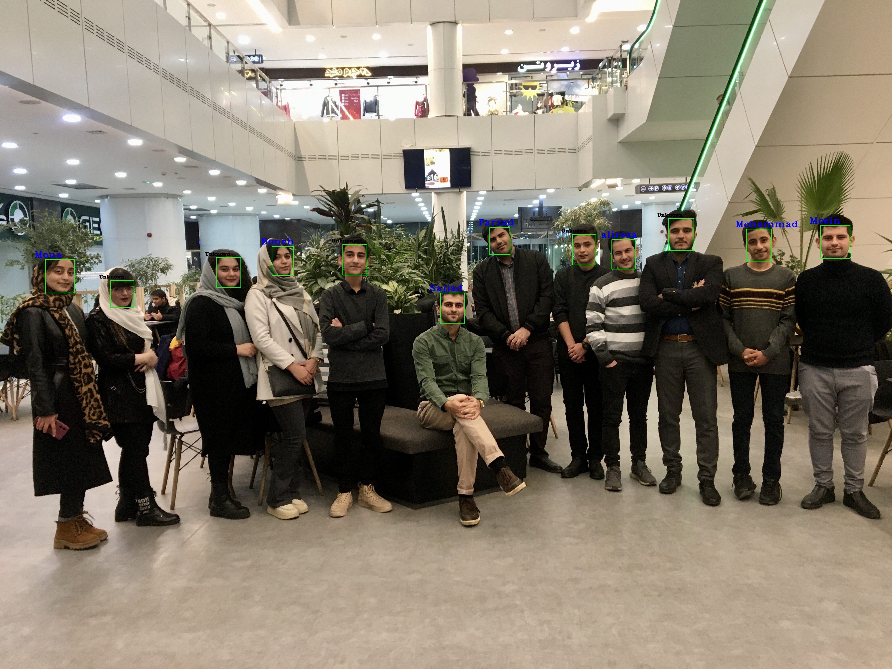

# Face Recognition 🧑
Real-time face recognition in unconstrained environments, based on [InsightFace](https://github.com/deepinsight/insightface). 
 🧑

 

<br>

# How to run
```
pip install -r requirements.txt
```
Download [weights](https://drive.google.com/file/d/1Z0Kh7fdPgfN7KUSLdg42agIy_ip1WR0f/view?usp=drive_link)
## create bank in face image:
run the following command:
```
python creatـfaceـbank.py
```
## Inference:
For face detection, run the following command:
```
python Face_Verification.py --image1 {YORE IMAGE} --image2 {YORE IMAGE}
```

For face identification, run the following command:
```
python nference_identification.py --input {YORE IMAGE} --update
```
Then run same command as above with `--update` argument. Note that After each change in `./face_bank` directory, you should use `--update` again.


For Face ID game, run the following command:
```
python Face_ID_game.py 
```